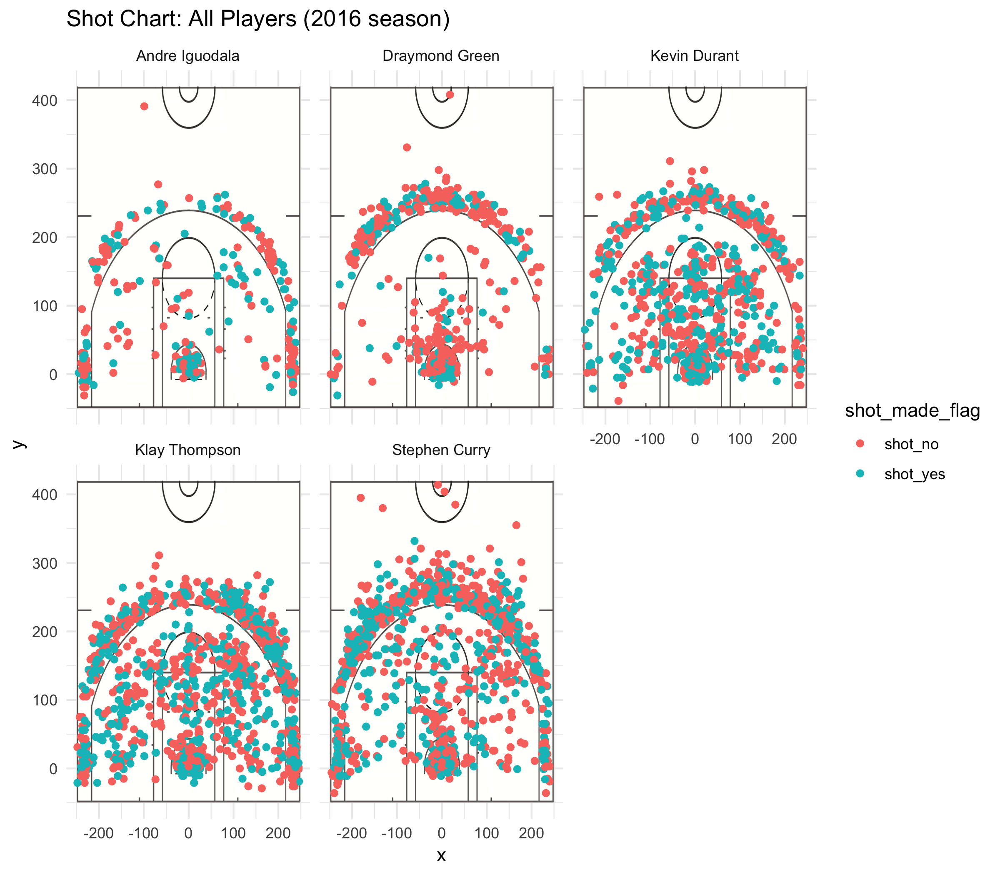

workout01-thomas-hoversen.Rmd
================
Thomas Hoversen

``` r
library(dplyr)
```

    ## 
    ## Attaching package: 'dplyr'

    ## The following objects are masked from 'package:stats':
    ## 
    ##     filter, lag

    ## The following objects are masked from 'package:base':
    ## 
    ##     intersect, setdiff, setequal, union

``` r
#Objects for easy import of data frame.
curry <- "/Users/thomashoversen-juckett/Desktop/workout01/data/stephen-curry.csv"
iguodala <- "/Users/thomashoversen-juckett/Desktop/workout01/data/andre-iguodala.csv"
green <- "/Users/thomashoversen-juckett/Desktop/workout01/data/draymond-green.csv"
durant <- "/Users/thomashoversen-juckett/Desktop/workout01/data/kevin-durant.csv"
thompson <- "/Users/thomashoversen-juckett/Desktop/workout01/data/klay-thompson.csv"
#Data frames by player
Curry <- read.csv(curry, stringsAsFactors = FALSE)
Iguodala <- read.csv(iguodala, stringsAsFactors = FALSE)
Green <- read.csv(green, stringsAsFactors = FALSE)
Durant <- read.csv(durant, stringsAsFactors = FALSE)
Thompson <- read.csv(thompson, stringsAsFactors = FALSE)
#Add column "name"
Curry <- mutate(Curry, name = "Stephen Curry")
Iguodala <- mutate(Iguodala, name = "Andre Iguodala")
Green <- mutate(Green, name = "Draymond Green")
Durant <- mutate(Durant, name = "Kevin Durant")
Thompson <- mutate(Thompson, name = "Klay Thompson")
#Change n and y to shot_no and shot_yes
Curry$shot_made_flag[Curry$shot_made_flag=="n"] <- "shot_no"
Curry$shot_made_flag[Curry$shot_made_flag=="y"] <- "shot_yes"

Iguodala$shot_made_flag[Iguodala$shot_made_flag=="n"] <- "shot_no"
Iguodala$shot_made_flag[Iguodala$shot_made_flag=="y"] <- "shot_yes"

Green$shot_made_flag[Green$shot_made_flag=="n"] <- "shot_no"
Green$shot_made_flag[Green$shot_made_flag=="y"] <- "shot_yes"

Durant$shot_made_flag[Durant$shot_made_flag=="n"] <- "shot_no"
Durant$shot_made_flag[Durant$shot_made_flag=="y"] <- "shot_yes"

Thompson$shot_made_flag[Thompson$shot_made_flag=="n"] <- "shot_no"
Thompson$shot_made_flag[Thompson$shot_made_flag=="y"] <- "shot_yes"
#Add a minute column.
Curry <- mutate(Curry, minute = (period*12) - minutes_remaining)
Iguodala <- mutate(Iguodala, minute = (period*12) - minutes_remaining)
Green <- mutate(Green, minute = (period*12) - minutes_remaining)
Thompson <- mutate(Thompson, minute = (period*12) - minutes_remaining)
Durant <- mutate(Durant, minute = (period*12) - minutes_remaining)
shots_data <- rbind(Curry, Iguodala, Green, Thompson, Durant)
```



    ## # A tibble: 5 x 4
    ##   name           total  made perc_made
    ##   <chr>          <int> <int>     <dbl>
    ## 1 Andre Iguodala   210   134     0.638
    ## 2 Draymond Green   346   171     0.494
    ## 3 Kevin Durant     643   390     0.607
    ## 4 Klay Thompson    640   329     0.514
    ## 5 Stephen Curry    563   304     0.540

    ## # A tibble: 5 x 4
    ##   name           total  made perc_made
    ##   <chr>          <int> <int>     <dbl>
    ## 1 Andre Iguodala   161    58     0.360
    ## 2 Draymond Green   232    74     0.319
    ## 3 Kevin Durant     272   105     0.386
    ## 4 Klay Thompson    580   246     0.424
    ## 5 Stephen Curry    687   280     0.408

    ## # A tibble: 5 x 4
    ##   name           total  made perc_made
    ##   <chr>          <int> <int>     <dbl>
    ## 1 Andre Iguodala   371   192     0.518
    ## 2 Draymond Green   578   245     0.424
    ## 3 Kevin Durant     915   495     0.541
    ## 4 Klay Thompson   1220   575     0.471
    ## 5 Stephen Curry   1250   584     0.467

------------------------------------------------------------------------

5.2 \*\*\*

The Golden State Warriors are certainly no strangers to scoring points. It should be no surprise, then, that the players Andre Iguodala, Draymond Green, Kevin Durant, Klay Thompson, and Stephen Curry make nearly 50% of the shots they shoot! The source of this astounding number will be detailed in this report, along with details about two pointer and three pointer shots, and graphical imagery to help the reader visualize where these shots were taken. By the end of this report the reader should know the players' total shots taken, total shots made, the percentages, and visual displays of where these shots were taken.

The motivation for this short article is to bring clarity and visual imagery to what we all already know: the Golden State Warriors make a lot of baskets! Additionally this article aims to weaken prevailing notions of "the best" and "the worst" and shed a new perspective on balancing skill with opportunity.

This data is from 2016 and specific to each player. The graphics that show the shots taken on the court come from the exact (x,y) coordinate of where they were taken in real life! Moreso the data comes from individual data sets that have been combined into one large data set to then analyze in bulk. Information has been scrubbed clean and the code and data is freely available upon request.

This analysis for the two pointer shots, three pointer shots, and total shots, comes from adding up all the shots in each category, two pointer for example, placing that next to the total number of shots that were actually made, and finally dividing the total shots attempted by total made in order to get the percentage of how many shots they make for each of the five players.

While all of the players show exceptional talent, one in particular stands out as having the highest percentage of shots made in regard to the number of shots attempted. This would be Kevin Durant. Durant makes an astounding 54.1% of all shots that he attempts! That number is more than half and is quite impressive considering the next highest percentage player is Andre Iguodala at 51.75%.

Let's dive a little deeper into Durant's shot attempts. Durant does exceptionally well overall but may not appear to be as great as first seems. He does very well shooting two-points, making about 60% of attempted shots. However when you look at his long shot three pointers the picture is less flowery. Durant scores only 38% of his three pointer attempts, compared to Steven Curry, who scores 40.7% of all shots. However the top of the pack of three pointers goes to none other than Klay Thompson. Of Thompson's 580 attempts at a three pointer shot, which is by the way the second highest attempted three pointer shots being evaluated here, he makes a whopping 42.4% of them. That's a strong arm and birds-eye aim!

However Thompson is not without his flaws. His two-pointer shots come in at the second lowest percentage, 51%. The only player being evaluated that is more terrible than Thompson at scoring two point shots is Draymond Green, scoring a meek 49%. Less than half! In fact Thompson should not be too happy to beat Green as it's not that impressive at all. Green is by far the worst player in this list, scoring the lowest percentages in two- AND three-pointer shots.

Draymond Green may not be the poorest quality player in the pack though. Depending on who you ask and what you value he may be a little bit better than one other person. Of course it goes without saying that if the standard to be evaluated is the number of shots made in relation to the number of shots attempted, then Green is the worst. However, not everyone would agree that this is the best metric to judge a player by. Statistically speaking it's hard to argue that anyone scores worse in this lineup. But just because Green doesn't make the most baskets doesn't mean he's the least active player on the team.

Some people may judge the players based on their participation and willingness to attempt shots in the first place. Looking at the second highest scoring player, Andre Iguodala, we see that he attempts even less baskets than Green. So while skill credit must definitely go to Iguodala, participation credit favors Green more. The level of importance this entails may not be high for the statistician, average sporting fan, or gambler. However, in the real world we cannot all be Kevin Durant, scoring 54% of attempted shots. Most of us are Green, mid to bottom of the pact. So, for the people who resonate with the personalities and willingness of the players, Green is not somebody to scoff at, but rather somebody to give credit to for making the attempts in the first place.

This point is not to say that in order to be the best, either figuratively speaking or statistically speaking, you need to shoot attempt the most shots. Green, for example, only shot more than Iguodala. So there are still three players shooting more. Green is only significant to mention using these standards because he scores the worst. In fact the two players that make the most attempts are neither of the top two players in terms of attempted shots divided by shots made.

The main take away from all of this information might be that skill is not always about who attempts the most shots, and that judging players is not always about who is the most skilled. Some may find Green to be admirable because he has the lowest percentage of shots made and yet he's still attempting more shots than the second highest. The best player is in the middle: He attempted 915 shots in total, making him exactly between the other players and yet scoring higher than them all. This may mean something. He does not shoot always, but when he feels confident in the shot. He's on the court often and is willing to take risks, but may be not the most risks. The fact he makes over 50% of his shots demonstrates that he is a combination of what we both admire and berate Green over: he has the skill to make baskets and the willingness, the desire to participate, to shoot often enough to do it.
